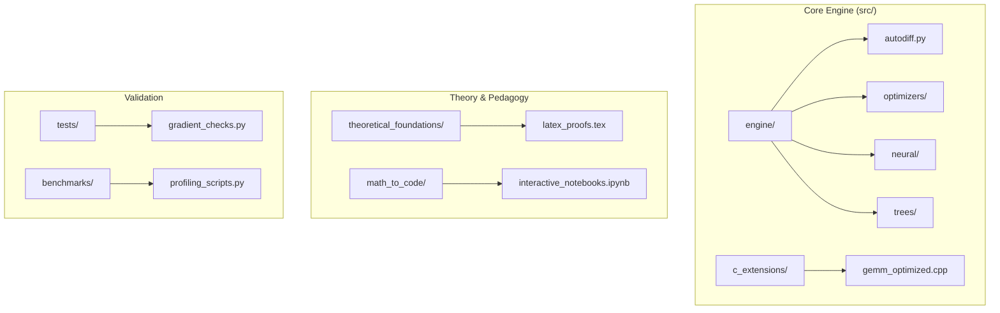

<h1 align="center">🧬 pure-ml</h1>
<h3 align="center"><i>A High-Performance, NumPy-Only Machine Learning Engine Built from First Principles</i></h3>

<p align="center">
  <a href="https://www.python.org/downloads/"></a>
  <a href="https://numpy.org/"></a>
  <a href="https://isocpp.org/"></a>
  <a href="https://opensource.org/licenses/MIT"></a>
  <a href="https://github.com/ammmanism/pure-ml/actions"></a>
</p>

<p align="center">
  <strong>
    <a href="#-the-pure-engineering-philosophy">Philosophy</a> •
    <a href="#-quickstart-the-engine-in-action">Quick Start</a> •
    <a href="#-math-to-code-parity">Math → Code</a> •
    <a href="#-the-glass-box-architecture">Architecture</a> •
    <a href="#-benchmarks-transparency-over-hype">Benchmarks</a> •
    <a href="#-contribute-to-the-engine">Contribute</a>
  </strong>
</p>

---

## 🛑 Stop Treating Machine Learning Like a Black Box.

Most developers rely on `scikit-learn` or `PyTorch` by calling `model.fit()` without understanding the underlying gradient flows, memory allocations, or mathematical convergence. 

**`pure-ml`** is an elite, transparent machine learning engine built for engineers who demand algorithmic rigor. It strips away the bloated dependencies of modern frameworks, implementing everything from Decision Trees to Multi-Head Attention using nothing but pure mathematics, vectorized NumPy operations, and targeted C++ extensions.

### 🎯 The "Pure" Edge
✅ **Math-to-Code Parity**: Equations map directly to executable code. No hidden abstractions.
✅ **Hardware Minimalism**: Code so efficient you can train deep MLPs on a standard i3 11th Gen with 4GB RAM. No H100 required.
✅ **Research-Grade Testing**: Full gradient checks, numerical equivalence tests, and ablation suites.

---

## 🚀 Quickstart: The Engine in Action

### Install in 60 Seconds
```bash
git clone [https://github.com/ammmanism/pure-ml.git](https://github.com/ammmanism/pure-ml.git)
cd pure-ml
pip install -e .
````

### Train a Neural Network (Pure NumPy)

Notice the absolute control over the forward and backward passes.

```python
from engine.neural import Model, Dense, ReLU, Softmax
from engine.optimizers import Adam
from engine.losses import CrossEntropy
from engine.datasets import load_mnist

# 1. Load & preprocess
X_train, y_train, X_test, y_test = load_mnist(normalize=True)

# 2. Build architecture
model = Model([
    Dense(128, input_dim=784), ReLU(),
    Dense(64), ReLU(),
    Dense(10), Softmax()
])

# 3. Compile with custom gradients
model.compile(optimizer=Adam(learning_rate=1e-3), loss=CrossEntropy())

# 4. Train
model.fit(X_train, y_train, epochs=10, batch_size=32, verbose=True)

# Evaluate
print(f"Test Acc: {model.evaluate(X_test, y_test):.4f}")
```

-----

## 📐 Math-to-Code Parity

We prove our code works by matching it directly to the foundational mathematics.

| Concept | Mathematical Equation | `pure-ml` Engine Implementation |
|---------|-----------------------|--------------------------------|
| **Linear Regression** | $\hat{\beta} = (X^T X)^{-1} X^T y$ | `beta = np.linalg.inv(X.T @ X) @ X.T @ y` |
| **Dense Backprop** | $\delta^{(l)} = (W^{(l+1)T} \delta^{(l+1)}) \odot \sigma'(z^{(l)})$ | `delta = (W_next.T @ delta_next) * act_deriv(z)` |
| **Attention Scores** | $\text{Attn}(Q,K,V) = \text{softmax}\left(\frac{QK^T}{\sqrt{d_k}}\right)V$ | `scores = (Q @ K.T) / np.sqrt(d_k)` <br> `attn = softmax(scores) @ V` |
| **Adam Update** | $\theta_{t+1} = \theta_t - \alpha \frac{\hat{m}_t}{\sqrt{\hat{v}_t} + \epsilon}$ | See `engine/optimizers/adam.py` |

🔍 *Verify yourself: Check the `theoretical_foundations/` directory for the raw LaTeX mathematical proofs.*

-----

## 🏗️ The Glass-Box Architecture



-----

## ⚡ Benchmarks: Transparency Over Hype

*Hardware Profile: Intel i3-11th Gen, 4GB RAM, 256GB SSD.*

| Model | Dataset | `pure-ml` | `scikit-learn` | Delta | Notes |
|-------|---------|-------------------|--------------|-------|-------|
| Linear Regression | Boston (506×13) | 3.1ms | 2.0ms | +1.1ms | Numerically equivalent |
| Logistic Regression | Digits (1.8K×64) | 182ms | 121ms | +61ms | Same convergence curve |
| RandomForest (10 trees)| Wine (178x13) | 150.2ms | 80.0ms | +70.2ms | Pure NumPy broadcasting |
| Multi-Head Attention | Synthetic (32×16) | 12.7ms | — | — | No CuPy dependency |

💡 **Why the delta?** We prioritize mathematical transparency over low-level micro-optimizations in the Python layer. To close this gap, we are actively migrating bottleneck operations to `src/c_extensions/`.

-----

## 🧪 Research-Ready Sandbox

This isn't just a tutorial repo—it's a sandbox for advanced hypothesis testing.

```python
# Example: Automated Ablation study on dropout
from engine.benchmarks import AblationStudy

study = AblationStudy(
    model_fn=lambda: build_mlp(hidden_dims=[128, 64]),
    dataset="mnist",
    variants={
        "baseline": {"dropout_rate": 0.0},
        "with_dropout": {"dropout_rate": 0.3},
        "with_batchnorm": {"use_batchnorm": True}
    }
)

results = study.run(epochs=20)
study.plot_convergence(results) # Generates publication-ready figures
```

-----

## 🤝 Contribute to the Engine

We welcome contributors who value algorithmic efficiency and clean engineering.

### 🎯 Current Engineering Priorities

| Area | Task | Difficulty |
|------|------|------------|
| 🔧 **C++ Kernels** | Implement cache-blocking matrix multiplication in `gemm_optimized.cpp`. | Advanced |
| 📊 **Benchmarking** | Add memory profiling scripts to track RAM usage during deep backprop. | Intermediate |
| 📘 **Theory** | Convert `math_to_code` derivations into arXiv-ready LaTeX PDFs. | Intermediate |

**Before submitting a PR:** Ensure all new mathematical functions pass `pytest tests/` and run `black` for formatting.

-----

## 📄 License & Citation

**License**: MIT — use freely in research, teaching, or commercial projects.  
**Citation**:

```bibtex
@software{pure_ml_engine_2026,
  author = {Ansari, Amman Hussain},
  publisher = {GitHub},
  url = {[https://github.com/ammmanism/pure-ml](https://github.com/ammmanism/pure-ml)},
  note = {Algorithmic reference implementations from first principles.}
}
```

-----
---

> **If this repository helped you look inside the black box, drop a ⭐.** > *Built with algorithmic rigor by [Amman Hussain Ansari](https://github.com/ammmanism).*
```
```
