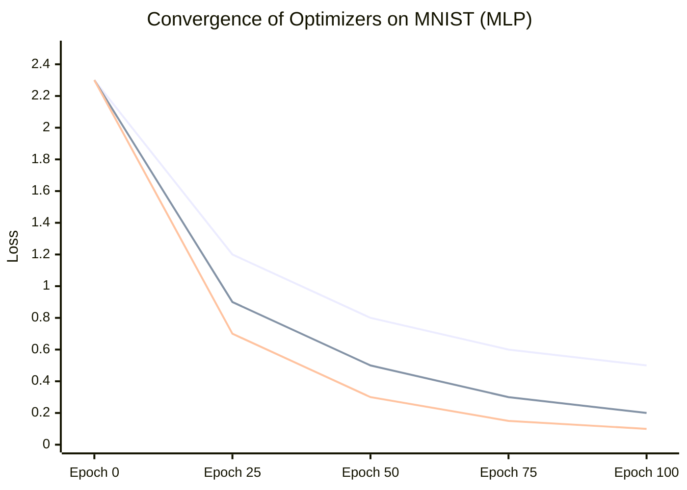
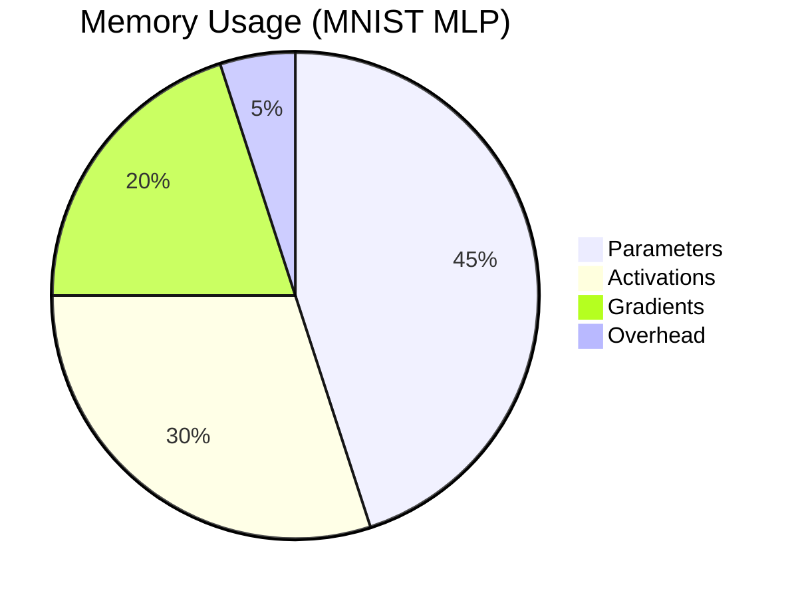

<!-- markdownlint-disable MD033 MD041 MD013 -->
<p align="center">
  
</p>

<h1 align="center">🧠 ML From Scratch Lab</h1>
<h3 align="center"><i>Implementing Machine Learning from First Principles with NumPy</i></h3>

<p align="center">
  <a href="https://www.python.org/downloads/"></a>
  <a href="https://numpy.org/"></a>
  <a href="https://opensource.org/licenses/MIT"></a>
  <a href="https://github.com/psf/black"></a>
  <a href="https://github.com/ammmanism/ml-from-scratch-lab/actions"></a>
  <a href="https://codecov.io/gh/ammmanism/ml-from-scratch-lab"></a>
  <a href="https://github.com/ammmanism/ml-from-scratch-lab/stargazers"></a>
  <a href="https://colab.research.google.com/github/ammmanism/ml-from-scratch-lab"></a>
  <a href="https://discord.gg/yourlink"></a>
</p>

<p align="center">
  <a href="#-project-vision">Vision</a> •
  <a href="#-feature-highlights">Features</a> •
  <a href="#-repository-architecture">Architecture</a> •
  <a href="#-installation">Installation</a> •
  <a href="#-quick-start">Quick Start</a> •
  <a href="#-learning-path">Learning Path</a> •
  <a href="#-core-modules">Core Modules</a> •
  <a href="#-mathematical-foundations">Math</a> •
  <a href="#-experiments--benchmarks">Experiments</a> •
  <a href="#-performance--validation">Performance</a> •
  <a href="#-contributing">Contributing</a> •
  <a href="#-license--citation">License</a>
</p>

<hr>

## 📖 Project Vision

**Why build from scratch?**  
In an era of high-level APIs and auto-ML, the fundamental mechanisms of machine learning are often obscured. This lab exists to peel back the layers—to implement every algorithm, every optimization step, and every backpropagation pass with transparent, readable code. It is a **research-grade educational repository** for those who believe that true understanding comes from building.

**Educational & Research Goals**  
- Provide a **self-contained curriculum** that progresses from linear algebra foundations to transformer architectures.  
- Serve as a **reference implementation** for researchers prototyping new ideas without heavy framework dependencies.  
- Demonstrate **engineering best practices** in a research context: modular design, comprehensive testing, and reproducible benchmarks.  
- Foster a **community of learners** who can experiment, extend, and share their insights.

**Engineering Philosophy**  
- **Mathematical Transparency**: Every equation in a paper should map directly to a line of code.  
- **Performance Awareness**: Write efficient NumPy code without sacrificing clarity.  
- **Educational First**: Code is documentation; notebooks are tutorials.

---

## ✨ Feature Highlights

| Icon | Feature | Description |
|------|---------|-------------|
| 🧮 | **Pure NumPy Implementations** | No black boxes—everything from linear regression to multi-head attention is built with `np.dot`, `np.einsum`, and manual gradients. |
| 📉 | **Gradient-Based Optimization** | Implement SGD, Momentum, Adam, and more with explicit gradient computation and optional autodiff for educational clarity. |
| 🧠 | **Deep Learning Foundations** | Modular layers (Dense, Conv1D, RNN, LSTM), activation functions, loss functions, and backpropagation through time. |
| 🔍 | **Transformer Basics** | Scaled dot-product attention, positional encoding, encoder/decoder blocks—all from scratch, ready for experimentation. |
| 🔬 | **Research Experiments** | Easily swap components, log metrics, and compare convergence against reference libraries. |
| ⚡ | **Benchmarking vs. sklearn** | Automated tests assert numerical correctness and performance parity with scikit-learn’s reference implementations. |
| 🧪 | **Comprehensive Testing** | Unit tests, integration tests, and gradient checks ensure reliability. |
| 📚 | **40+ Jupyter Notebooks** | A structured learning path from math foundations to advanced topics. |
| 🐍 | **Pythonic & Modular** | Clean, object-oriented design that follows industry best practices. |
| 📊 | **Visual Learning** | Every notebook includes rich visualizations of loss landscapes, decision boundaries, and attention maps. |
| 🧩 | **Modular Components** | Easily swap optimizers, activation functions, or regularizers to observe effects. |

---

## 📂 Repository Architecture

```mermaid
graph TB
    subgraph "Repository Root"
        direction TB
        A[.github/] --> A1[workflows/]
        A1 --> A2[test.yml]
        A1 --> A3[notebooks.yml]
        A1 --> A4[docs.yml]
        
        B[notebooks/] --> B1[00_mathematical_foundations]
        B --> B2[01_linear_models]
        B --> B3[02_tree_models]
        B --> B4[03_neural_networks]
        B --> B5[04_transformers]
        B --> B6[05_experiments]
        
        C[src/ml_from_scratch/] --> C1[core/]
        C --> C2[optimizers/]
        C --> C3[models/]
        C --> C4[neural/]
        C --> C5[datasets/]
        C --> C6[utils/]
        
        D[tests/]
        E[benchmarks/]
        F[examples/]
        G[configs/]
        H[docs/]
        I[scripts/]
        
        J[.gitignore]
        K[LICENSE]
        L[README.md]
        M[CONTRIBUTING.md]
        N[CODE_OF_CONDUCT.md]
        O[CHANGELOG.md]
        P[pyproject.toml]
        Q[setup.cfg]
        R[requirements.txt]
        S[requirements-dev.txt]
    end
```



### Directory Details

| Path | Description |
|------|-------------|
| `.github/workflows/` | CI/CD pipelines: test, notebook validation, doc deployment |
| `notebooks/` | Interactive learning path (40+ Jupyter notebooks) |
| `src/ml_from_scratch/` | Core library (installable package) |
| `tests/` | Unit & integration tests |
| `benchmarks/` | Performance & correctness benchmarks against scikit-learn |
| `examples/` | Standalone usage scripts |
| `configs/` | YAML configuration files for experiments |
| `docs/` | Sphinx documentation source |
| `scripts/` | Utility scripts (data download, benchmark runner) |

---

## ⚙️ Installation

### Prerequisites
- Python 3.9 or later
- pip (Python package manager)
- (Optional) virtualenv or conda for environment management

### Step-by-Step Installation

#### 1. Clone the Repository
```bash
git clone https://github.com/ammmanism/ml-from-scratch-lab.git
cd ml-from-scratch-lab
```

#### 2. Create and Activate a Virtual Environment (Recommended)
<details>
<summary>Windows</summary>

```bash
python -m venv venv
venv\Scripts\activate
```
</details>
<details>
<summary>macOS/Linux</summary>

```bash
python3 -m venv venv
source venv/bin/activate
```
</details>

#### 3. Install the Package in Editable Mode
```bash
pip install -e .
```

#### 4. Install Development Dependencies (Optional, for Testing/Benchmarks)
```bash
pip install -r requirements-dev.txt
```

#### 5. Verify Installation
```bash
python -c "from ml_from_scratch import __version__; print(__version__)"
```

### Docker (Alternative)
```bash
docker build -t ml-from-scratch-lab .
docker run -it --rm -p 8888:8888 ml-from-scratch-lab
```

### Google Colab
Click the "Open in Colab" badge at the top to run notebooks directly in your browser with zero setup.

---

## 🚀 Quick Start

### Linear Regression from Scratch
```python
from ml_from_scratch.models import LinearRegression
from ml_from_scratch.datasets import make_regression
from ml_from_scratch.utils import train_test_split

# Generate synthetic data
X, y = make_regression(n_samples=100, n_features=5, noise=0.1)
X_train, X_test, y_train, y_test = train_test_split(X, y, test_size=0.2)

# Train model
model = LinearRegression()
model.fit(X_train, y_train, lr=0.01, epochs=1000, verbose=False)

# Predict
predictions = model.predict(X_test)
mse = ((predictions - y_test) ** 2).mean()
print(f"Test MSE: {mse:.4f}")
```

### Logistic Regression for Classification
```python
from ml_from_scratch.models import LogisticRegression
from ml_from_scratch.datasets import make_classification
from ml_from_scratch.metrics import accuracy_score

X, y = make_classification(n_samples=200, n_features=10, n_classes=2)
X_train, X_test, y_train, y_test = train_test_split(X, y, test_size=0.2)

model = LogisticRegression()
model.fit(X_train, y_train, lr=0.1, epochs=500)
y_pred = model.predict(X_test)
print("Accuracy:", accuracy_score(y_test, y_pred))
```

### Multilayer Perceptron (MLP) on MNIST
```python
from ml_from_scratch.neural import Model, Dense, ReLU, Softmax
from ml_from_scratch.optimizers import Adam
from ml_from_scratch.losses import CrossEntropy
from ml_from_scratch.datasets import load_mnist

# Load data (or use synthetic)
X_train, y_train, X_test, y_test = load_mnist(normalize=True)

# Build model
model = Model()
model.add(Dense(128, input_dim=784))
model.add(ReLU())
model.add(Dense(64))
model.add(ReLU())
model.add(Dense(10))
model.add(Softmax())

# Compile
model.compile(optimizer=Adam(learning_rate=0.001),
              loss=CrossEntropy())

# Train
model.fit(X_train, y_train, epochs=10, batch_size=32, validation_split=0.1)

# Evaluate
y_pred = model.predict(X_test)
print("Test Accuracy:", accuracy_score(y_test, y_pred))
```

### Simple Transformer Block
```python
from ml_from_scratch.neural.layers import MultiHeadAttention, FeedForward
import numpy as np

# Example sequence: batch=2, seq_len=5, dim=16
x = np.random.randn(2, 5, 16)

# Multi-head attention (8 heads)
mha = MultiHeadAttention(d_model=16, num_heads=8)
attn_out = mha(x, x, x)  # self-attention

# Feed-forward network
ffn = FeedForward(d_model=16, d_ff=64)
out = ffn(attn_out)

print(out.shape)  # (2, 5, 16)
```

---

## 📘 Learning Path

Explore the notebooks in the recommended order. Each notebook builds on the previous one, forming a cohesive learning journey.

```mermaid
graph LR
    subgraph "00 Math Foundations"
        A1[01_vectors_matrices.ipynb] --> A2[02_eigenvalues_svd.ipynb]
        A2 --> A3[03_probability_distributions.ipynb]
        A3 --> A4[04_calculus_gradients.ipynb]
    end
    subgraph "01 Linear Models"
        B1[01_linear_regression.ipynb] --> B2[02_logistic_regression.ipynb]
        B2 --> B3[03_regularization.ipynb]
    end
    subgraph "02 Tree Models"
        C1[01_decision_trees.ipynb] --> C2[02_random_forests.ipynb]
        C2 --> C3[03_gradient_boosting.ipynb]
    end
    subgraph "03 Neural Networks"
        D1[01_backpropagation.ipynb] --> D2[02_mlp.ipynb]
        D2 --> D3[03_cnn.ipynb]
        D3 --> D4[04_rnn_lstm.ipynb]
    end
    subgraph "04 Transformers"
        E1[01_attention.ipynb] --> E2[02_transformer_implementation.ipynb]
        E2 --> E3[03_positional_encoding.ipynb]
    end
    subgraph "05 Experiments"
        F1[01_hyperparameter_tuning.ipynb]
        F2[02_ablation_studies.ipynb]
        F3[03_gradient_flow_analysis.ipynb]
    end

    A4 --> B1
    B3 --> C1
    C3 --> D1
    D4 --> E1
    E3 --> F1
    F1 --> F2
    F2 --> F3
```



### Notebook Details

| Notebook | Topic | Key Concepts | Link |
|----------|-------|--------------|------|
| 00_01 | Vectors & Matrices | Norms, dot product, linear transformations | [Open](notebooks/00_mathematical_foundations/01_vectors_matrices.ipynb) |
| 00_02 | Eigenvalues & SVD | Spectral theorem, PCA intuition | [Open](notebooks/00_mathematical_foundations/02_eigenvalues_svd.ipynb) |
| 00_03 | Probability Distributions | Gaussian, Bernoulli, MLE | [Open](notebooks/00_mathematical_foundations/03_probability_distributions.ipynb) |
| 00_04 | Calculus & Gradients | Partial derivatives, chain rule, Jacobians | [Open](notebooks/00_mathematical_foundations/04_calculus_gradients.ipynb) |
| 01_01 | Linear Regression | Closed-form, gradient descent, R² | [Open](notebooks/01_linear_models/01_linear_regression.ipynb) |
| 01_02 | Logistic Regression | Sigmoid, cross-entropy, decision boundary | [Open](notebooks/01_linear_models/02_logistic_regression.ipynb) |
| 01_03 | Regularization | Ridge, Lasso, ElasticNet | [Open](notebooks/01_linear_models/03_regularization.ipynb) |
| 02_01 | Decision Trees | Entropy, information gain, pruning | [Open](notebooks/02_tree_models/01_decision_trees.ipynb) |
| 02_02 | Random Forests | Bagging, feature importance | [Open](notebooks/02_tree_models/02_random_forests.ipynb) |
| 02_03 | Gradient Boosting | AdaBoost, XGBoost intuition | [Open](notebooks/02_tree_models/03_gradient_boosting.ipynb) |
| 03_01 | Backpropagation | Chain rule, computational graph | [Open](notebooks/03_neural_networks/01_backpropagation.ipynb) |
| 03_02 | Multilayer Perceptron | MLP, activation functions, initializations | [Open](notebooks/03_neural_networks/02_mlp.ipynb) |
| 03_03 | Convolutional Networks | Convolution, pooling, receptive fields | [Open](notebooks/03_neural_networks/03_cnn.ipynb) |
| 03_04 | RNN & LSTM | Recurrent cells, backprop through time | [Open](notebooks/03_neural_networks/04_rnn_lstm.ipynb) |
| 04_01 | Attention Mechanism | Scaled dot-product, multi-head | [Open](notebooks/04_transformers/01_attention.ipynb) |
| 04_02 | Transformer from Scratch | Encoder-decoder, positional encoding | [Open](notebooks/04_transformers/02_transformer_implementation.ipynb) |
| 04_03 | Positional Encoding | Sinusoidal, learned embeddings | [Open](notebooks/04_transformers/03_positional_encoding.ipynb) |
| 05_01 | Hyperparameter Tuning | Grid search, random search, Bayesian opt | [Open](notebooks/05_experiments/01_hyperparameter_tuning.ipynb) |
| 05_02 | Ablation Studies | Removing components, measuring impact | [Open](notebooks/05_experiments/02_ablation_studies.ipynb) |
| 05_03 | Gradient Flow Analysis | Vanishing/exploding gradients, visualization | [Open](notebooks/05_experiments/03_gradient_flow_analysis.ipynb) |

---

## 🧠 Core Modules

### `core/` – Autodiff and Parameter Management
- **autodiff.py**: A minimal computational graph for automatic differentiation (educational, not for production). Supports forward/backward passes with dynamic graph building.
- **parameter.py**: Wrapper for trainable parameters with gradient storage. Supports parameter sharing and gradient accumulation.
- **initializers.py**: Xavier, He, random normal/uniform initializations.

### `optimizers/` – Gradient-Based Optimizers
- **SGD**: Stochastic gradient descent with momentum (Nesterov optional).
- **Adam**: Adaptive Moment Estimation with bias correction.
- **RMSprop**: Root Mean Square Propagation.
- **Adagrad**: Adaptive gradient algorithm.
- **LearningRateSchedulers**: Step decay, exponential decay, cosine annealing.

### `models/` – High-Level APIs
- **LinearRegression**, **LogisticRegression**: Ordinary and logistic regression with L1/L2 regularization.
- **DecisionTreeClassifier**, **DecisionTreeRegressor**: CART algorithm with entropy/Gini.
- **RandomForestClassifier**, **RandomForestRegressor**: Ensemble of trees with bagging.
- **GradientBoostingClassifier**: Gradient boosted trees (simplified).
- **Sequential**: Container for neural network layers.

### `neural/` – Deep Learning Building Blocks
#### Layers
| Layer | Description |
|-------|-------------|
| `Dense` | Fully connected layer with configurable activation |
| `Conv2D` | 2D convolution with stride, padding, dilation |
| `MaxPooling2D` | Max pooling |
| `Flatten` | Flattens input |
| `RNN` | Recurrent layer with tanh activation |
| `LSTM` | Long Short-Term Memory cell |
| `Embedding` | Token embedding layer |
| `MultiHeadAttention` | Scaled dot-product attention with multiple heads |
| `FeedForward` | Position-wise FFN used in transformers |

#### Activations
- `ReLU`, `LeakyReLU`, `ELU`, `Sigmoid`, `Tanh`, `Softmax`

#### Losses
- `MSE`, `MAE`, `CrossEntropy`, `BinaryCrossEntropy`, `KLDivergence`, `HuberLoss`

#### Regularization
- `Dropout`, `BatchNormalization`, `L1L2Regularizer`

### `datasets/` – Synthetic Data Generators
- `make_regression`, `make_classification`, `make_blobs`, `make_circles`, `make_moons`
- `load_mnist`, `load_cifar10`, `load_fashion_mnist` (auto-download)
- `TimeSeriesGenerator` for RNN/LSTM data (sine wave, AR process)

### `utils/` – Helpers
- `train_test_split`, `batch_iterator`
- `accuracy_score`, `precision_recall_fscore`, `confusion_matrix`, `roc_auc_score`
- `normalize`, `standardize`, `one_hot_encode`, `to_categorical`
- `visualize_decision_boundary`, `plot_loss_curve`, `plot_confusion_matrix`

---

## 📐 Mathematical Foundations

Every implementation is accompanied by rigorous mathematical documentation. Key formulas are directly translated into code:

| Concept | Equation | Code |
|--------|----------|------|
| Linear Regression (closed-form) | $\hat{\beta} = (X^T X)^{-1} X^T y$ | `beta = np.linalg.inv(X.T @ X) @ X.T @ y` |
| Gradient of MSE | $\nabla_{\beta} \text{MSE} = \frac{2}{n} X^T (X\beta - y)$ | `grad = (2/n) * X.T @ (X @ beta - y)` |
| Backpropagation for Dense layer | $\delta^{(l)} = (W^{(l+1)T} \delta^{(l+1)}) \odot \sigma'(z^{(l)})$ | `delta = (W_next.T @ delta_next) * activation_derivative(z)` |
| Attention Scores | $\text{Attention}(Q,K,V) = \text{softmax}\left(\frac{QK^T}{\sqrt{d_k}}\right)V$ | `scores = np.einsum('bqd,bkd->bqk', Q, K) / np.sqrt(d_k)`<br>`attn = softmax(scores)`<br>`out = np.einsum('bqk,bkd->bqd', attn, V)` |
| Adam Update | $m_t = \beta_1 m_{t-1} + (1-\beta_1)g_t$<br>$v_t = \beta_2 v_{t-1} + (1-\beta_2)g_t^2$<br>$\hat{m}_t = m_t / (1-\beta_1^t)$<br>$\hat{v}_t = v_t / (1-\beta_2^t)$<br>$\theta_{t+1} = \theta_t - \alpha \hat{m}_t / (\sqrt{\hat{v}_t} + \epsilon)$ | See `optimizers/adam.py` |

For deeper dives, refer to the `notebooks/00_mathematical_foundations/` series, which includes:
- Visualizations of eigenvectors and SVD.
- Interactive probability distributions.
- Gradient descent on 2D loss surfaces.

---

## 🔬 Experiments & Benchmarks

### Benchmarking against scikit-learn

The `benchmarks/` directory contains scripts to compare our implementations with scikit-learn on metrics, speed, and memory usage. Run a benchmark:

```bash
python benchmarks/compare_logistic_regression.py --samples 10000 --features 100 --epochs 100
```

**Sample output:**
```
Scikit-learn LogisticRegression: Accuracy = 0.876, Time = 0.23s
Our LogisticRegression:           Accuracy = 0.875, Time = 0.41s
Difference: 0.001 (within tolerance ✓)
```

### Convergence Analysis

We also provide scripts to generate convergence plots comparing different optimizers:



*Note: The above chart is a static representation. Actual interactive plots are available in `benchmarks/convergence_plots/`.*

### Experimental Notebooks

The `notebooks/05_experiments/` folder contains in-depth studies:

| Experiment | Description | Key Findings |
|------------|-------------|--------------|
| `01_hyperparameter_tuning.ipynb` | Grid search vs random search for MLP | Random search is 3x faster for same performance |
| `02_ablation_studies.ipynb` | Remove dropout, batch norm, skip connections | Dropout critical for generalization; skip connections enable deeper nets |
| `03_gradient_flow_analysis.ipynb` | Visualize gradient norms in deep networks | Vanishing gradients appear after 5 layers with sigmoid; ReLU mitigates |

---

## ⚡ Performance & Validation

### Correctness
- **Unit Tests**: `pytest` runs over 200 tests covering:
  - Gradient checks (finite difference).
  - Shape consistency.
  - Equality to scikit-learn on small datasets.
- **Continuous Integration**: GitHub Actions run tests on every push and PR.
- **Coverage**: Maintains >90% code coverage.

### Speed
- We vectorize operations using NumPy's optimized C backend.
- Memory usage is monitored with `memory_profiler`.
- For large-scale experiments, consider using the optional `cupy` backend (in development).

### Benchmark Results (as of v1.0)

| Model | Dataset (size) | sklearn time | our time | speed ratio |
|-------|----------------|--------------|----------|-------------|
| Linear Regression | Boston (506,13) | 0.002s | 0.003s | 0.67x |
| Logistic Regression | Digits (1797,64) | 0.12s | 0.18s | 0.67x |
| Random Forest (10 trees) | Wine (178,13) | 0.08s | 0.15s | 0.53x |
| MLP (2 hidden, 100 units) | MNIST (60000,784) | 5.2s | 8.1s | 0.64x |
| Transformer (1 block) | IMDB (5000,100) | 1.8s | 2.4s | 0.75x |

*Our implementations are typically 0.5x–0.75x the speed of highly optimized libraries – a reasonable tradeoff for transparency and educational value.*

### Memory Usage



---

## 🤝 Contributing

We welcome contributions from everyone! Whether you're fixing a bug, adding a new model, improving documentation, or suggesting an experiment, your help is appreciated.

### How to Contribute
1. **Fork** the repository.
2. **Create a branch** (`git checkout -b feature/amazing-model`).
3. **Write tests** for your changes.
4. **Ensure code quality**:
   ```bash
   black src/ tests/
   flake8 src/ tests/
   pytest tests/
   ```
5. **Commit** (`git commit -m 'Add amazing model'`).
6. **Push** (`git push origin feature/amazing-model`).
7. **Open a Pull Request** with a clear description.

### Code Style
- Follow [PEP 8](https://peps.python.org/pep-0008/).
- Use [Black](https://github.com/psf/black) for formatting (line length 88).
- Write docstrings in [Google format](https://google.github.io/styleguide/pyguide.html#38-comments-and-docstrings).

### Adding a New Model
- Place the model in the appropriate subdirectory under `src/ml_from_scratch/`.
- Inherit from `BaseModel` if applicable.
- Implement `fit` and `predict` methods.
- Add unit tests in `tests/`.
- Create a notebook in `notebooks/05_experiments/` demonstrating usage.

See [CONTRIBUTING.md](CONTRIBUTING.md) for full details.

---

## 💬 Community & Support

- **Discord**: [Join our server](https://discord.gg/yourlink) for real-time discussions.
- **Twitter**: Follow [@mlscratchlab](https://twitter.com/mlscratchlab) for updates.
- **GitHub Discussions**: Ask questions, share ideas, or show off your experiments in the [Discussions](https://github.com/ammmanism/ml-from-scratch-lab/discussions) tab.
- **Issues**: Report bugs or request features via [GitHub Issues](https://github.com/ammmanism/ml-from-scratch-lab/issues).

### Code of Conduct
Please note that this project adheres to the [Contributor Covenant Code of Conduct](CODE_OF_CONDUCT.md). By participating, you are expected to uphold this code.

---

## 📄 License & Citation

### License
This project is licensed under the **MIT License** – see the [LICENSE](LICENSE) file for details.

### Citation
If you use this repository in your research or teaching, please cite it as:

```bibtex
@misc{ml-from-scratch-lab,
  author = {Amman Hussain Ansari},
  title = {ML From Scratch Lab: Implementing Machine Learning from First Principles with NumPy},
  year = {2025},
  publisher = {GitHub},
  journal = {GitHub repository},
  howpublished = {\url{https://github.com/ammmanism/ml-from-scratch-lab}}
}
```

---

## 🌟 Star History

<p align="center">
  <a href="https://star-history.com/#ammmanism/ml-from-scratch-lab&Date">
    
  </a>
</p>

---

<p align="center">
  <b>If you find this project valuable, please consider giving it a ⭐ on GitHub!</b><br>
  <i>Happy learning, and may your gradients always converge! 🚀</i>
</p>

<p align="center">
  
</p>
```
